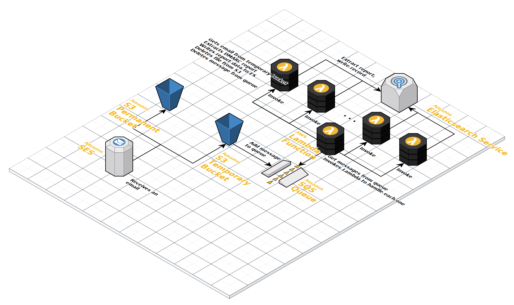

# dmarc-import-tf-module #

[](https://github.com/cisagov/dmarc-import-tf-module/actions)

`dmarc-import-tf-module` contains the Terraform configuration files to
build the AWS infrastructure used for parsing DMARC aggregate reports.
This repository goes along with
[`dmarc-import`](https://github.com/cisagov/dmarc-import), which
contains the actual source code for ingesting, parsing, and saving the
DMARC aggregate reports.

Here is a [Cloudcraft.co](https://cloudcraft.co) diagram of the basic
infrastructure created by these Terraform files:


## Usage ##

```hcl
module "dmarc_import" {
  source = "github.com/cisagov/dmarc-import-tf-module"

  providers = {
    aws = aws.dnsprovisionaccount
  }

  aws_region                = var.aws_region
  elasticsearch_domain_name = var.elasticsearch_domain_name
  elasticsearch_index       = var.elasticsearch_index
  elasticsearch_type        = var.elasticsearch_type
  emails                    = var.emails
  lambda_function_name      = var.lambda_function_name
  lambda_function_zip_file  = var.lambda_function_zip_file
  permanent_bucket_name     = var.permanent_bucket_name
  queue_name                = var.queue_name
  rule_set_name             = var.rule_set_name
  temporary_bucket_name     = var.temporary_bucket_name
}
```

## Examples ##

No examples.

## Requirements ##

| Name | Version |
|------|---------|
| terraform | ~> 0.14.0 |
| aws | ~> 3.38 |

## Providers ##

| Name | Version |
|------|---------|
| aws | ~> 3.38 |

## Modules ##

No modules.

## Resources ##

| Name | Type |
|------|------|
| [aws_cloudwatch_event_rule.lambda](https://registry.terraform.io/providers/hashicorp/aws/latest/docs/resources/cloudwatch_event_rule) | resource |
| [aws_cloudwatch_event_target.lambda](https://registry.terraform.io/providers/hashicorp/aws/latest/docs/resources/cloudwatch_event_target) | resource |
| [aws_cloudwatch_log_group.es_logs](https://registry.terraform.io/providers/hashicorp/aws/latest/docs/resources/cloudwatch_log_group) | resource |
| [aws_cloudwatch_log_group.logs](https://registry.terraform.io/providers/hashicorp/aws/latest/docs/resources/cloudwatch_log_group) | resource |
| [aws_cloudwatch_log_resource_policy.es_cloudwatch_policy](https://registry.terraform.io/providers/hashicorp/aws/latest/docs/resources/cloudwatch_log_resource_policy) | resource |
| [aws_elasticsearch_domain.es](https://registry.terraform.io/providers/hashicorp/aws/latest/docs/resources/elasticsearch_domain) | resource |
| [aws_iam_role.lambda](https://registry.terraform.io/providers/hashicorp/aws/latest/docs/resources/iam_role) | resource |
| [aws_iam_role_policy.cloudwatch_policy](https://registry.terraform.io/providers/hashicorp/aws/latest/docs/resources/iam_role_policy) | resource |
| [aws_iam_role_policy.es_policy](https://registry.terraform.io/providers/hashicorp/aws/latest/docs/resources/iam_role_policy) | resource |
| [aws_iam_role_policy.lambda_lambda](https://registry.terraform.io/providers/hashicorp/aws/latest/docs/resources/iam_role_policy) | resource |
| [aws_iam_role_policy.s3_lambda](https://registry.terraform.io/providers/hashicorp/aws/latest/docs/resources/iam_role_policy) | resource |
| [aws_iam_role_policy.sqs_policy](https://registry.terraform.io/providers/hashicorp/aws/latest/docs/resources/iam_role_policy) | resource |
| [aws_lambda_function.lambda](https://registry.terraform.io/providers/hashicorp/aws/latest/docs/resources/lambda_function) | resource |
| [aws_lambda_permission.allow_cloudwatch](https://registry.terraform.io/providers/hashicorp/aws/latest/docs/resources/lambda_permission) | resource |
| [aws_s3_bucket.permanent](https://registry.terraform.io/providers/hashicorp/aws/latest/docs/resources/s3_bucket) | resource |
| [aws_s3_bucket.temporary](https://registry.terraform.io/providers/hashicorp/aws/latest/docs/resources/s3_bucket) | resource |
| [aws_s3_bucket_notification.notification](https://registry.terraform.io/providers/hashicorp/aws/latest/docs/resources/s3_bucket_notification) | resource |
| [aws_s3_bucket_policy.permanent_policy](https://registry.terraform.io/providers/hashicorp/aws/latest/docs/resources/s3_bucket_policy) | resource |
| [aws_s3_bucket_policy.temporary_policy](https://registry.terraform.io/providers/hashicorp/aws/latest/docs/resources/s3_bucket_policy) | resource |
| [aws_ses_active_receipt_rule_set.active](https://registry.terraform.io/providers/hashicorp/aws/latest/docs/resources/ses_active_receipt_rule_set) | resource |
| [aws_ses_receipt_rule.rule](https://registry.terraform.io/providers/hashicorp/aws/latest/docs/resources/ses_receipt_rule) | resource |
| [aws_ses_receipt_rule_set.rules](https://registry.terraform.io/providers/hashicorp/aws/latest/docs/resources/ses_receipt_rule_set) | resource |
| [aws_sqs_queue.dead_letter](https://registry.terraform.io/providers/hashicorp/aws/latest/docs/resources/sqs_queue) | resource |
| [aws_sqs_queue.dmarc_reports](https://registry.terraform.io/providers/hashicorp/aws/latest/docs/resources/sqs_queue) | resource |
| [aws_sqs_queue_policy.dmarc_reports](https://registry.terraform.io/providers/hashicorp/aws/latest/docs/resources/sqs_queue_policy) | resource |
| [aws_caller_identity.current](https://registry.terraform.io/providers/hashicorp/aws/latest/docs/data-sources/caller_identity) | data source |
| [aws_iam_policy_document.assume_role](https://registry.terraform.io/providers/hashicorp/aws/latest/docs/data-sources/iam_policy_document) | data source |
| [aws_iam_policy_document.cloudwatch_lambda](https://registry.terraform.io/providers/hashicorp/aws/latest/docs/data-sources/iam_policy_document) | data source |
| [aws_iam_policy_document.es_cloudwatch_doc](https://registry.terraform.io/providers/hashicorp/aws/latest/docs/data-sources/iam_policy_document) | data source |
| [aws_iam_policy_document.es_lambda](https://registry.terraform.io/providers/hashicorp/aws/latest/docs/data-sources/iam_policy_document) | data source |
| [aws_iam_policy_document.lambda_lambda](https://registry.terraform.io/providers/hashicorp/aws/latest/docs/data-sources/iam_policy_document) | data source |
| [aws_iam_policy_document.s3_lambda](https://registry.terraform.io/providers/hashicorp/aws/latest/docs/data-sources/iam_policy_document) | data source |
| [aws_iam_policy_document.s3_sqs](https://registry.terraform.io/providers/hashicorp/aws/latest/docs/data-sources/iam_policy_document) | data source |
| [aws_iam_policy_document.ses_permanent_s3_doc](https://registry.terraform.io/providers/hashicorp/aws/latest/docs/data-sources/iam_policy_document) | data source |
| [aws_iam_policy_document.ses_temporary_s3_doc](https://registry.terraform.io/providers/hashicorp/aws/latest/docs/data-sources/iam_policy_document) | data source |
| [aws_iam_policy_document.sqs_lambda](https://registry.terraform.io/providers/hashicorp/aws/latest/docs/data-sources/iam_policy_document) | data source |

## Inputs ##

| Name | Description | Type | Default | Required |
|------|-------------|------|---------|:--------:|
| aws\_region | The AWS region to deploy into (e.g. us-east-1). | `string` | `"us-east-1"` | no |
| elasticsearch\_domain\_name | The domain name of the Elasticsearch instance. | `string` | n/a | yes |
| elasticsearch\_index | The Elasticsearch index to which to write DMARC aggregate report data. | `string` | n/a | yes |
| elasticsearch\_type | The Elasticsearch type corresponding to a DMARC aggregate report. | `string` | n/a | yes |
| emails | A list of the email addresses at which DMARC aggregate reports are being received. | `list(string)` | n/a | yes |
| lambda\_function\_name | The name to use for the Lambda function. | `string` | n/a | yes |
| lambda\_function\_zip\_file | The location of the zip file for the Lambda function. | `string` | n/a | yes |
| permanent\_bucket\_name | The name of the S3 bucket where the DMARC aggregate report emails are stored permanently. | `string` | n/a | yes |
| queue\_name | The name of the SQS queue where events will be sent as DMARC aggregate reports are received. | `string` | n/a | yes |
| rule\_set\_name | The name of the SES rule set that processes DMARC aggregate reports. | `string` | n/a | yes |
| temporary\_bucket\_name | The name of the S3 bucket where the DMARC aggregate report emails are stored temporarily (until processed). | `string` | n/a | yes |

## Outputs ##

| Name | Description |
|------|-------------|
| elasticsearch\_domain | The Elasticsearch domain. |

## Notes ##

Running `pre-commit` requires running `terraform init` in every directory that
contains Terraform code. In this repository, this is just the main directory.

## Contributing ##

We welcome contributions!  Please see [`CONTRIBUTING.md`](CONTRIBUTING.md) for
details.

## License ##

This project is in the worldwide [public domain](LICENSE).

This project is in the public domain within the United States, and
copyright and related rights in the work worldwide are waived through
the [CC0 1.0 Universal public domain
dedication](https://creativecommons.org/publicdomain/zero/1.0/).

All contributions to this project will be released under the CC0
dedication. By submitting a pull request, you are agreeing to comply
with this waiver of copyright interest.
